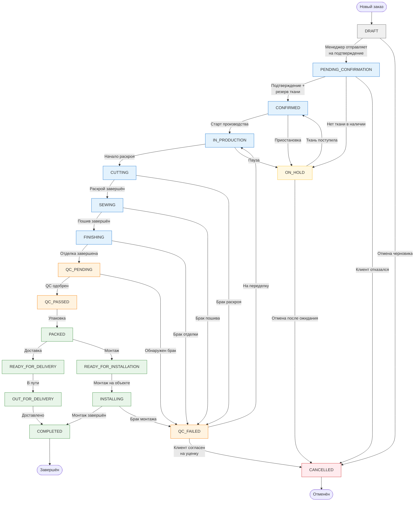

# WORKFLOW.md — Бизнес-процессы ателье штор «Бригада»

> **Version:** 2.0  
> **Domain:** Atelier Curtain Manufacturing  
> **Pattern:** Finite State Machine + Event-Driven Architecture  
> **Goal:** Core of mini-ERP for textile atelier with real-world production workflow

---

## 1. Введение

Система автоматизирует полный цикл производства штор — от первичной заявки клиента до финальной установки готового изделия. В отличие от простого CRUD, это **операционная система ателье**, которая управляет состояниями заказа, контролирует остатки тканей, распределяет нагрузку между швеями и обеспечивает прозрачность процесса для всех участников.

---

## 2. Основные сущности (Core Domain Model)

### 2.1 Order (Производственный заказ)
```python
class Order:
    id: UUID                    # Уникальный номер заказа
    client: Client              # Заказчик
    manager: Manager            # Ответственный менеджер
    status: OrderStatus         # Текущее состояние (FSM)
    product_template: Template   # Шаблон изделия (шторы, портьеры, тюль)
    measurements: JSON          # Замеры окна (ширина, высота, тип карниза)
    fabrics: List[FabricReservation]  # Зарезервированные ткани
    tasks: List[Task]          # Производственные операции
    deadline: DateTime          # Дата готовности
    total_cost: Decimal        # Полная стоимость
    deposit_paid: Decimal      # Предоплата
```

### 2.2 Task (Производственная операция)
```python
class Task:
    id: UUID
    order: Order                # Родительский заказ
    operation_type: OperationType  # Тип операции
    worker: Worker              # Назначенный исполнитель
    status: TaskStatus          # Состояние задачи
    estimated_minutes: int      # Норма времени
    actual_minutes: int         # Фактическое время
    quality_score: int          # Оценка QC (1-10)
    depends_on: Task            # Зависимость от предыдущей операции
    sequence: int               # Порядок в маршруте
```

**OperationType для штор:**
- `FABRIC_PREPARATION` — Подготовка ткани (подкраив, отпаривание)
- `CUTTING` — Раскрой
- `SEWING` — Пошив основного полотна
- `LINING_ATTACHMENT` — Пришивание подкладки
- `HEMMING` — Подрубка краёв
- `EYELET_INSTALLATION` — Установка люверсов
- `HOOK_ATTACHMENT` — Пришивание крючков/тесьмы
- `STEAMING` — Отпаривание
- `QUALITY_CONTROL` — Контроль качества
- `PACKAGING` — Упаковка
- `DELIVERY_PREP` — Подготовка к доставке/установке

### 2.3 InventoryItem (Ткань / Фурнитура)
```python
class InventoryItem:
    id: UUID
    name: str                   # Название ("Велюр Мокко", "Тюль Белый-лед")
    category: Category          # Тип: MAIN_FABRIC | LINING | TULLE | HARDWARE
    supplier: Supplier          # Поставщик
    width_cm: int              # Ширина рулона
    current_meters: Decimal     # Остаток в метрах
    reserved_meters: Decimal    # Зарезервировано
    available_meters: Decimal   # Доступно (current - reserved)
    price_per_meter: Decimal    # Цена закупки
    min_stock_level: Decimal    # Минимальный остаток (alert)
```

### 2.4 FabricReservation (Резервирование ткани)
```python
class FabricReservation:
    id: UUID
    inventory_item: InventoryItem
    order: Order
    meters_reserved: Decimal    # Метраж для резерва
    status: ReservationStatus   # PENDING | CONFIRMED | CONSUMED | RELEASED
    reserved_at: DateTime
    confirmed_at: DateTime
```

### 2.5 Worker (Производственный персонал)
```python
class Worker:
    id: UUID
    user: User
    role: WorkerRole            # CUTTER | SEAMSTRESS | QC | INSTALLER
    specializations: List[OperationType]  # Что умеет делать
    max_parallel_tasks: int     # Макс. одновременных задач (default: 3)
    current_load: int           # Текущая загрузка
    efficiency_rating: float    # Коэффициент эффективности
```

### 2.6 ProductTemplate (Шаблон изделия)
```python
class ProductTemplate:
    id: UUID
    name: str                   # "Классические портьеры с подкладкой"
    category: ProductCategory   # CURTAIN | TULLE | ROMAN_SHADE | etc.
    default_operations: List[OperationTemplate]  # Стандартный маршрут
    fabric_calculator: Formula  # Формула расчёта метража
    hardware_requirements: List[HardwareItem]   # Фурнитура по умолчанию
```

---

## 3. Finite State Machine для Order

### 3.1 Все статусы заказа

| Статус | Код | Описание |
|--------|-----|----------|
| **DRAFT** | `draft` | Черновик, создан менеджером, ещё не подтверждён |
| **PENDING_CONFIRMATION** | `pending_confirmation` | Ожидает подтверждения (замеры, расчёт материалов) |
| **CONFIRMED** | `confirmed` | Подтверждён, ткань зарезервирована |
| **IN_PRODUCTION** | `in_production` | В производстве, задачи назначены |
| **CUTTING** | `cutting` | Этап раскроя |
| **SEWING** | `sewing` | Этап пошива |
| **FINISHING** | `finishing` | Отделка, люверсы, подрубка |
| **QC_PENDING** | `qc_pending` | Ожидает контроль качества |
| **QC_FAILED** | `qc_failed` | Не прошёл QC, требуется переделка |
| **QC_PASSED** | `qc_passed` | Прошёл контроль качества |
| **PACKED** | `packed` | Упакован, готов к выдаче/установке |
| **READY_FOR_DELIVERY** | `ready_for_delivery` | Готов к доставке |
| **READY_FOR_INSTALLATION** | `ready_for_installation` | Готов к установке |
| **OUT_FOR_DELIVERY** | `out_for_delivery` | В процессе доставки |
| **INSTALLING** | `installing` | Монтаж на объекте |
| **COMPLETED** | `completed` | Завершён, клиенту выдано/установлено |
| **CANCELLED** | `cancelled` | Отменён |
| **ON_HOLD** | `on_hold` | Приостановлен (ждёт материалов, решения клиента) |

### 3.2 Разрешённые переходы (State Transitions)

```
DRAFT
  → PENDING_CONFIRMATION        [manager: submit_for_confirmation]
  → CANCELLED                   [manager: cancel_draft]

PENDING_CONFIRMATION
  → CONFIRMED                   [manager: confirm, auto: reserve_fabric]
  → ON_HOLD                     [manager: hold_for_materials]
  → CANCELLED                   [manager: cancel, auto: release_reservations]

CONFIRMED
  → IN_PRODUCTION               [system: auto_on_start_date OR manager: start_production]
  → ON_HOLD                     [manager: hold]
  → CANCELLED                   [manager: cancel, auto: release_reservations]

IN_PRODUCTION
  → CUTTING                     [auto: first_task_is_cutting]
  → ON_HOLD                     [manager: pause]

CUTTING
  → SEWING                      [auto: cutting_tasks_done]
  → QC_FAILED                   [qc: reject_cutting_quality]

SEWING
  → FINISHING                   [auto: sewing_done]
  → QC_FAILED                   [qc: reject_sewing]

FINISHING
  → QC_PENDING                  [auto: all_production_done]
  → QC_FAILED                   [qc: reject_finishing]

QC_PENDING
  → QC_PASSED                   [qc: approve]
  → QC_FAILED                   [qc: reject_with_rework]

QC_FAILED
  → IN_PRODUCTION               [manager: send_for_rework]
  → CANCELLED                   [client: approve_partial_with_discount]

QC_PASSED
  → PACKED                      [worker: package]

PACKED
  → READY_FOR_DELIVERY          [manager: schedule_delivery]
  → READY_FOR_INSTALLATION      [manager: schedule_installation]

READY_FOR_DELIVERY
  → OUT_FOR_DELIVERY            [logistics: start_delivery]

READY_FOR_INSTALLATION
  → INSTALLING                  [installer: start_installation]

OUT_FOR_DELIVERY
  → COMPLETED                   [system: delivered_confirmed]

INSTALLING
  → COMPLETED                   [installer: finish_installation]
  → QC_FAILED                   [client: reject_installation_quality]

COMPLETED
  → (terminal state)
  → CANCELLED                   [admin: force_cancel_with_refund]  # edge case

CANCELLED
  → (terminal state)

ON_HOLD
  → CONFIRMED                   [manager: resume]
  → CANCELLED                   [manager: cancel_after_hold]
```

---

## 4. Mermaid-диаграмма состояний заказа



---

## 5. Happy-Path Бизнес-поток

### Шаг 1: Создание заказа (DRAFT → PENDING_CONFIRMATION)

**Действующее лицо:** Менеджер

1. Менеджер создаёт Order через API/админку
2. Вводит данные клиента (или выбирает существующего)
3. Выбирает шаблон изделия (например, "Портьеры с люверсами, двойные")
4. Вносит замеры окна:
   - Ширина проёма: 320 см
   - Высота: 280 см
   - Тип крепления: карниз скрытого монтажа
5. Система **автоматически**:
   - Рассчитывает необходимый метраж ткани (с учётом коэфф. сборки 2.5)
   - Подбирает рекомендуемые ткани из каталога
   - Рассчитывает предварительную стоимость
6. Менеджер корректирует расчёт, добавляет позиции (тюль, подхваты)
7. Нажимает «Отправить на подтверждение»
8. **Система:**
   - Переводит Order в `PENDING_CONFIRMATION`
   - Создаёт задачу для менеджера: «Проверить наличие ткани»
   - Отправляет клиенту SMS: «Ваш заказ №123 принят, ожидаем подтверждения сроков»

**События:**
- `order.created`
- `order.status_changed` (DRAFT → PENDING_CONFIRMATION)

---

### Шаг 2: Подтверждение и резервирование ткани (PENDING_CONFIRMATION → CONFIRMED)

**Действующее лицо:** Менеджер + Система

1. Менеджер проверяет наличие ткани:
   ```
   Велюр "Мокко" - требуется 8.5 м, в наличии 45 м → OK
   Подкладка "Бежевая" - требуется 8.5 м, в наличии 3 м → НЕДОСТАТОЧНО
   ```

2. **Сценарий А — Ткань есть:**
   - Менеджер резервирует ткань
   - **Система:**
     - Создаёт `FabricReservation` (status=PENDING)
     - Блокирует 8.5 м в `InventoryItem.reserved_meters`
     - Резерв переводится в status=CONFIRMED
   - Менеджер подтверждает дату готовности (deadline)
   - **Система:**
     - Переводит Order в `CONFIRMED`
     - Генерирует производственные задачи по шаблону

3. **Сценарий Б — Ткани недостаточно:**
   - Менеджер переводит Order в `ON_HOLD`
   - Создаёт задачу закупщику
   - Уведомляет клиента: «Ожидаем поставку ткани, срок +3 дня»

**События:**
- `fabric.reserved`
- `order.status_changed` (PENDING_CONFIRMATION → CONFIRMED)
- `inventory.low_stock` (если остаток ниже min_stock_level)

---

### Шаг 3: Генерация задач по шаблону изделия

**Действующее лицо:** Система (автоматически при переходе в CONFIRMED)

Для шаблона «Портьеры с люверсами, двойные» система создаёт маршрут:

| # | Операция | Исполнитель | Зависит от | Время (норма) |
|---|----------|-------------|------------|---------------|
| 1 | FABRIC_PREPARATION | Раскройщик | — | 30 мин |
| 2 | CUTTING | Раскройщик | #1 | 60 мин |
| 3 | LINING_ATTACHMENT | Швея | #2 | 90 мин |
| 4 | SEWING | Швея | #3 | 120 мин |
| 5 | HEMMING | Швея | #4 | 45 мин |
| 6 | EYELET_INSTALLATION | Швея | #5 | 30 мин |
| 7 | STEAMING | Парильщик | #6 | 20 мин |
| 8 | QUALITY_CONTROL | Контролёр | #7 | 15 мин |
| 9 | PACKAGING | Упаковщик | #8 | 10 мин |

**Система:**
- Создаёт Task для каждой операции
- Устанавливает `depends_on` для соблюдения порядка
- Устанавливает `sequence` для сортировки
- **Событие:** `tasks.generated` (order_id, count=9)

---

### Шаг 4: Назначение задач работникам

**Действующее лицо:** Система (auto-assignment) или Менеджер (ручное)

**Алгоритм автоназначения:**
```python
def assign_tasks(order):
    for task in order.tasks.filter(status=PENDING):
        available_workers = find_workers(
            can_perform=task.operation_type,
            current_load__lt=worker.max_parallel_tasks,
            is_active=True
        )
        
        # Сортируем по загрузке (менее загруженные первыми)
        available_workers.sort(key=lambda w: w.current_load)
        
        if available_workers:
            best_worker = available_workers[0]
            task.assign_to(best_worker)
            best_worker.current_load += 1
            
            # Уведомление швеи
            notify_worker(best_worker, f"Новая задача: {task.operation_type}")
```

**Результат:**
- Все задачи назначены
- Order переходит в `IN_PRODUCTION`
- **Событие:** `order.status_changed` (CONFIRMED → IN_PRODUCTION)
- **Событие:** `task.assigned` (task_id, worker_id)

---

### Шаг 5: Выполнение задач (IN_PRODUCTION → QC_PENDING)

**Действующее лицо:** Работники (швеи, раскройщики, контролёры)

**Flow для одной задачи:**

1. **Швея открывает панель «Мои задачи»**
   - Видит: Task #4 (SEWING) — Пошив полотна, Order #123

2. **Начало работы:**
   - Швея нажимает «Начать работу»
   - **Система:**
     - Проверяет: предыдущая задача (#3) завершена? ✅
     - Устанавливает `task.status = IN_PROGRESS`
     - Устанавливает `task.started_at = now()`
     - Order переходит в `SEWING` (текущий этап)
   - **Событие:** `task.started`

3. **Завершение работы:**
   - Швея нажимает «Завершить»
   - Вводит фактическое время: 110 мин (норма: 120)
   - **Система:**
     - Устанавливает `task.status = DONE`
     - Устанавливает `task.completed_at = now()`
     - Устанавливает `task.actual_minutes = 110`
     - Проверяет: все задачи текущего этапа завершены?

4. **Автоматический переход этапов:**
   - Все задачи CUTTING завершены → Order → `SEWING`
   - Все задачи SEWING завершены → Order → `FINISHING`
   - Все задачи FINISHING завершены → Order → `QC_PENDING`

---

### Шаг 6: Контроль качества (QC_PENDING → QC_PASSED)

**Действующее лицо:** Контролёр QC

1. Контролёр получает уведомление: «Заказ #123 готов к QC»
2. Проверяет изделие по чек-листу:
   - ✅ Швы ровные, нет пропусков
   - ✅ Люверсы на одинаковой высоте
   - ✅ Размеры соответствуют замерам (320×280 ±2 см)
   - ✅ Ткань без повреждений

3. **Если QC пройден:**
   - Контролёр выставляет `quality_score = 9`
   - Нажимает «QC пройден»
   - **Система:**
     - Order → `QC_PASSED`
     - Task QC → `DONE`
   - **Событие:** `order.status_changed` (QC_PENDING → QC_PASSED)

4. **Если обнаружен брак:**
   - Контролёр описывает дефект: «Неравномерная сборка, правый край короче на 3 см»
   - Выставляет `quality_score = 4`
   - Order → `QC_FAILED`
   - **Событие:** `qc.failed` (order_id, defect_description, rework_required=True)

---

### Шаг 7: Упаковка и подготовка к выдаче (QC_PASSED → PACKED)

**Действующее лицо:** Упаковщик

1. Упаковщик получает задачу PACKAGING
2. Упаковывает шторы:
   - Полиэтилен для защиты
   - Картонный короб (если доставка)
   - Инструкция по уходу + чек
3. Прикрепляет этикетку с номером заказа
4. Отмечает задачу выполненной
5. **Система:**
   - Order → `PACKED`
   - **Событие:** `order.packed`

---

### Шаг 8: Доставка или установка (PACKED → COMPLETED)

**Сценарий А — Доставка:**
1. Менеджер переводит Order в `READY_FOR_DELIVERY`
2. Курьер забирает изделие, Order → `OUT_FOR_DELIVERY`
3. Курьер доставляет, клиент подписывает акт
4. Курьер отмечает в мобильном приложении: «Доставлено»
5. **Система:**
   - Order → `COMPLETED`
   - **Событие:** `order.completed` (delivery_method=courier)

**Сценарий Б — Установка (white glove service):**
1. Менеджер назначает дату монтажа
2. Order → `READY_FOR_INSTALLATION`
3. Установщик приезжает на объект
4. Установщик переводит Order в `INSTALLING`
5. Выполняет монтаж карниза и подвешивание штор
6. Клиент подписывает акт выполненных работ
7. Установщик отмечает: «Монтаж завершён»
8. **Система:**
   - Order → `COMPLETED`
   - **Событие:** `order.completed` (delivery_method=installation)

---

### Шаг 9: Финализация и списание материалов (COMPLETED)

**Действующее лицо:** Система (автоматически)

1. **Списание ткани:**
   ```python
   for reservation in order.fabric_reservations:
       if reservation.status == CONFIRMED:
           # Переводим резерв в CONSUMED
           reservation.status = CONSUMED
           
           # Списываем с остатков
           fabric = reservation.inventory_item
           fabric.current_meters -= reservation.meters_reserved
           fabric.reserved_meters -= reservation.meters_reserved
           
           # Проверяем критический остаток
           if fabric.available_meters < fabric.min_stock_level:
               emit_event('inventory.critical_low', fabric_id=fabric.id)
   ```

2. **Финансовое закрытие:**
   - Если была предоплата — создаём задачу «Напомнить об остатке платежа»
   - Если полная оплата — заказ полностью закрыт

3. **Уведомление клиента:**
   - SMS: «Спасибо за заказ! Оставьте отзыв: [ссылка]»

**События:**
- `fabric.consumed`
- `inventory.low_stock` (если сработал)
- `order.finished`

---

## 6. Edge-кейсы и исключения

### 6.1 Недостаток ткани при подтверждении

**Сценарий:** В заказе требуется 12 м велюра, в наличии только 8 м.

**Решение:**
1. Менеджер видит alert: «Недостаточно ткани Велюр Мокко (нужно 12 м, есть 8 м)»
2. Варианты действий:
   - A) Перевести в `ON_HOLD`, заказать ткань у поставщика (срок +5 дней)
   - B) Предложить клиенту альтернативную ткань из наличия
   - C) Разбить заказ: сшить из доступного (8 м) + докупить для остального
3. **Система:** не позволяет подтвердить заказ без резервирования всех материалов

---

### 6.2 Брак на этапе QC (QC_FAILED)

**Сценарий:** Шторы прошли пошив, но QC обнаружил кривые швы.

**Решение:**
1. Order → `QC_FAILED`
2. Автоматически создаётся rework-task:
   - Тип: `REWORK_SEWING`
   - Приоритет: HIGH
   - Назначается той же швеёй (или другой, если повторный брак)
3. **Варианты:**
   - **Переделка:** Отправляем в `IN_PRODUCTION`, швея исправляет
   - **Уценка:** Клиент согласен принять с дефектом со скидкой 30%
   - **Отмена:** Если дефект критичен и невозможно исправить

---

### 6.3 Отмена после подтверждения (CONFIRMED → CANCELLED)

**Сценарий:** Клиент отменил заказ через 2 дня после подтверждения.

**Решение:**
1. Менеджер инициирует отмену
2. **Проверка состояния:**
   - Если ткань уже разрезана (CUTTING начат) → отмена невозможна без потерь
   - Если ткань только зарезервирована → можно отменить
3. **Система:**
   - Order → `CANCELLED`
   - `FabricReservation` → `RELEASED`
   - Освобождаем reserved_meters в InventoryItem
   - Создаём задачу «Вернуть предоплату клиенту»

---

### 6.4 Задержка поставки ткани (ON_HOLD)

**Сценарий:** Заказ в статусе `ON_HOLD` уже 10 дней, ткань не поставляется.

**Решение:**
1. Автоматическое напоминание менеджеру (каждые 3 дня)
2. Если >14 дней — предложить клиенту альтернативу или отмену
3. Если клиент не отвечает >7 дней — архивация заказа (soft delete)

---

### 6.5 Перегрузка работника

**Сценарий:** Швея Айгуль имеет 5 активных задач (max=3), но менеджер пытается назначить ещё.

**Решение:**
```python
if worker.current_load >= worker.max_parallel_tasks:
    raise OverloadError(
        f"{worker.name} перегружена (5/3 задач). "
        f"Назначьте другому работнику или дождитесь освобождения."
    )
```

**Система:**
- Предлагает альтернативных швей с меньшей загрузкой
- Или ставит задачу в очередь ожидания

---

### 6.6 Повреждение ткани в процессе

**Сценарий:** Раскройщик случайно испортил 2 м дорогого велюра.

**Решение:**
1. Раскройщик отмечает в системе: «Повреждение материала»
2. **Система:**
   - Списывает 2 м как `WASTE`
   - Проверяет: достаточно ли осталось для заказа?
   - Если недостаточно → Order → `ON_HOLD` (нужна докупка)
3. Менеджер принимает решение:
   - A) Докупить у поставщика (срок +3 дня)
   - B) Использовать аналогичную ткань (согласовать с клиентом)
   - C) Списать на брак, начать раскрой заново

---

### 6.7 Частичная готовность (комплексный заказ)

**Сценарий:** Заказ включает 4 окна. 3 готовы, 1 требует переделки.

**Решение:**
1. Order остаётся в `QC_FAILED` пока всё не готово
2. Готовые позиции можно отгружать частично (частичная доставка)
3. При частичной доставке:
   - Order получает флаг `partial_delivery=True`
   - Создаётся под-задача на вторую доставку
   - Финальный расчёт только после полной готовности

---

## 7. Role Matrix (Матрица ролей)

| Действие | Client (Клиент) | Manager (Менеджер) | Worker (Швея/Монтажник) | Admin (Админ) |
|----------|-----------------|-------------------|------------------------|---------------|
| **Просмотр заказов** | Свои | Все | Назначенные | Все |
| **Создание заказа** | Через форму | Да | Нет | Да |
| **Подтверждение заказа** | Нет | Да | Нет | Да |
| **Изменение статуса** | Нет | Да | Свои задачи | Да |
| **Отмена заказа** | Запрос | Да | Нет | Да |
| **Резерв ткани** | Нет | Да | Нет | Да |
| **Назначение задач** | Нет | Да | Нет | Да |
| **Выполнение задач** | Нет | Нет | Свои | Нет |
| **QC (контроль качества)** | Нет | Нет | QC-роль | Да |
| **Просмотр склада** | Нет | Да | Чтение | Да |
| **Закупка ткани** | Нет | Да | Нет | Да |
| **Управление ценами** | Нет | Да | Нет | Да |
| **Отчёты и аналитика** | Нет | Да | Своя статистика | Полные |
| **Управление пользователями** | Нет | Нет | Нет | Да |
| **Настройка системы** | Нет | Нет | Нет | Да |

### Детализация прав Worker

| Worker Role | Может выполнять |
|-------------|-----------------|
| **CUTTER** (Раскройщик) | FABRIC_PREPARATION, CUTTING |
| **SEAMSTRESS** (Швея) | LINING_ATTACHMENT, SEWING, HEMMING, EYELET_INSTALLATION, HOOK_ATTACHMENT |
| **STEAMER** (Парильщик) | STEAMING |
| **QC** (Контролёр) | QUALITY_CONTROL |
| **PACKER** (Упаковщик) | PACKAGING |
| **INSTALLER** (Установщик) | DELIVERY_PREP, INSTALLING |

---

## 8. События системы (System Events)

### 8.1 Order Events

| Событие | Триггер | Обработчики |
|---------|---------|-------------|
| `order.created` | Создан черновик заказа | Логирование, уведомление менеджеру |
| `order.status_changed` | Переход FSM | История изменений, уведомление клиенту |
| `order.confirmed` | Подтверждён | Резервирование ткани, генерация задач |
| `order.qc_failed` | Брак на QC | Уведомление швеи, создание rework-task |
| `order.completed` | Завершён | Списание ткани, финальный расчёт, SMS клиенту |
| `order.cancelled` | Отменён | Освобождение резервов, возврат предоплаты |
| `order.on_hold` | Приостановлен | Уведомление клиенту о задержке |

### 8.2 Task Events

| Событие | Триггер | Обработчики |
|---------|---------|-------------|
| `task.created` | Задача сгенерирована | Назначение работнику |
| `task.assigned` | Назначен исполнитель | Уведомление работнику |
| `task.started` | Работник начал | Проверка зависимостей, таймер |
| `task.completed` | Работник завершил | Проверка перехода Order в следующий статус |
| `task.reassigned` | Переназначена | Уведомление старому и новому работнику |
| `task.overdue` | Просрочена (по deadline) | Alert менеджеру |

### 8.3 Inventory Events

| Событие | Триггер | Обработчики |
|---------|---------|-------------|
| `fabric.reserved` | Ткань зарезервирована | Обновление available_meters |
| `fabric.consumed` | Ткань списана | Уменьшение current_meters |
| `fabric.released` | Резерв отменён | Возврат в available |
| `inventory.low_stock` | Остаток ниже min | Alert закупщику, уведомление менеджеров |
| `inventory.critical_low` | Остаток < 20% min | Срочный alert, блокировка новых заказов с этой тканью |
| `inventory.waste_recorded` | Зафиксирован брак/отход | Учёт в отчётах, анализ причин |

### 8.4 User/Auth Events

| Событие | Триггер | Обработчики |
|---------|---------|-------------|
| `worker.overload_warning` | >80% загрузки | Предупреждение менеджеру |
| `worker.task_completed_early` | <80% нормы времени | Бонусный учёт, повышение рейтинга |
| `worker.task_completed_late` | >120% нормы | Анализ причин, обучение |

---

## 9. Индикаторы и метрики (KPIs)

### 9.1 Производственные метрики

```python
# Эффективность раскроя
cutting_efficiency = (actual_cut_meters / reserved_meters) * 100

# Процент брака
qc_fail_rate = (qc_failed_orders / total_qc_orders) * 100

# Среднее время выполнения заказа
avg_order_lead_time = avg(completed_at - confirmed_at)

# Загрузка цеха
workshop_utilization = sum(active_task_minutes) / (workers_count * shift_minutes)
```

### 9.2 Финансовые метрики

```python
# Маржинальность заказа
order_margin = (total_price - fabric_cost - labor_cost - overhead) / total_price

# Стоимость брака
defect_cost = sum(wasted_fabric_cost) + sum(rework_labor_cost)

# Оборачиваемость ткани
fabric_turnover = fabric_consumed_per_month / avg_inventory_value
```

---

## 10. Интеграции и внешние каналы

### 10.1 Уведомления клиентам

| Событие | Канал | Содержание |
|---------|-------|------------|
| Заказ создан | SMS | «Заказ №123 принят. Срок готовности: 15 января» |
| Заказ подтверждён | SMS + Email | Детали заказа, сумма, реквизиты для оплаты |
| Готов к выдаче | SMS | «Шторы готовы! Адрес: ул. ..., часы работы: ...» |
| Доставка назначена | SMS | «Доставка завтра с 10:00 до 14:00» |
| Задержка | SMS + Звонок | «Извините, срок сдвинулся на 3 дня из-за ...» |

### 10.2 Интеграции

- **1C:Бухгалтерия** — выгрузка заказов для бухучёта
- **СМС-шлюз (SMSC.ru)** — уведомления клиентам
- **Телеграм-бот** — уведомления менеджерам
- **Google Calendar** — бронирование слотов установки

---

## Приложение: Терминология ателье штор

| Термин | Описание |
|--------|----------|
| **Портьера** | Тяжёлая штора из плотной ткани |
| **Тюль/Гардина** | Лёгкая прозрачная штора |
| **Подкладка** | Внутренний слой для плотности и защиты |
| **Люверс** | Металлическое кольцо для крепления на штангу |
| **Крючок** | Крючок для крепления на кольцо/тесьму |
| **Подрубка** | Обработка края ткани (подгиб + строчка) |
| **Раскрой** | Резка ткани по размеру |
| **Сборка** | Коэффициент складок (обычно 2.0–2.8×) |
| **Отпаривание** | Паровая обработка для удаления складок |
| **Карниз** | Конструкция для крепления штор |

---

**Document Owner:** Backend Architect  
**Last Updated:** 2024-01-15  
**Status:** Production Ready
